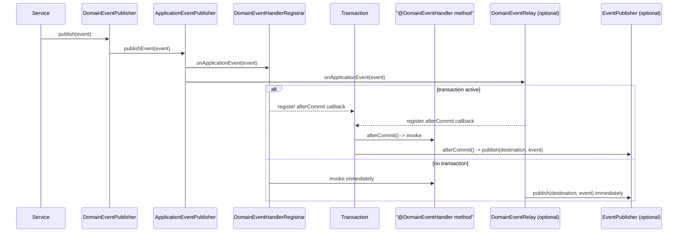

# Events

In-process domain events: publish with `DomainEventPublisher`, handle with `@DomainEventHandler`,
dispatched after the enclosing transaction commits when one is active (immediately otherwise).

## What you get

- **`DomainEventPublisher`** — `publish(DomainEvent event)`, bridged to Spring's
  `ApplicationEventPublisher`.
- **`@DomainEventHandler`** — marks a method handling `DomainEvent`s of its single parameter's
  exact runtime type.
- **After-commit dispatch** — a handler only runs once the enclosing transaction commits; it never
  runs if the transaction rolls back. Runs immediately when no transaction is active.
- **Optional integration-event relay** — `@EventType`-annotated domain events can be re-published
  as integration events via the messaging capability's `EventPublisher`, after commit.
- **`/actuator/platform`** reports `events[ACTIVE]`.

## Sequence



## Starter coordinates

```xml
<dependency>
  <groupId>ae.gov.dubaicustoms.platform</groupId>
  <artifactId>platform-starter-events</artifactId>
</dependency>
```

## Zero-config behavior

```java
record OrderPlaced(String orderId) implements DomainEvent {}

@Service
class OrdersService {
    private final DomainEventPublisher publisher;

    OrdersService(DomainEventPublisher publisher) {
        this.publisher = publisher;
    }

    @Transactional
    void place(String orderId) {
        // ... persist the order ...
        publisher.publish(new OrderPlaced(orderId));
    }
}

@Component
class OrderNotifications {
    @DomainEventHandler
    void onOrderPlaced(OrderPlaced event) {
        // runs only after the surrounding transaction commits
    }
}
```

## Properties

| Key | Default | Meaning |
|---|---|---|
| `dc.platform.events.enabled` | `true` | Kill switch for the whole capability. |
| `dc.platform.events.relay.enabled` | `false` | Opt-in: re-publish `@EventType`-annotated domain events as integration events. |
| `dc.platform.events.relay.destination-prefix` | `dc.` | Prefix + `@EventType` value forms the integration-event destination. |

(Hand-written until the generated reference lands in phase 14.)

## Relay: a lightweight outbox precursor

The relay publishes the integration event on the same after-commit callback as
`@DomainEventHandler` dispatch — a process crash between the local commit and the publish call
still loses the integration event. This is intentional for phase 7: a true transactional outbox
(durable staging row written in the same transaction, published by a separate process) is a
documented future enhancement, not implemented here. See `docs/decisions/decision-log.md` (D32).

To enable it, add a messaging starter (e.g. `platform-starter-messaging-inmemory`) alongside
`platform-starter-events` and set `dc.platform.events.relay.enabled=true`.

## Customize

- Define your own `AfterCommitDispatcher` bean to change dispatch timing platform-wide.
- Define your own `DomainEventPublisher` bean to replace the default entirely.

## Replace / Disable

- `dc.platform.events.enabled=false` switches the capability off wholesale.
- `dc.platform.events.relay.enabled=false` (the default) keeps the relay off even with messaging present.

## Testing

No Docker or network required. Use a `TransactionTemplate` (or `@Transactional` test methods with
`@Commit`) against any `PlatformTransactionManager` — even a plain H2 `DataSourceTransactionManager`
— to assert after-commit/rollback semantics without a full JPA setup.

## Local dev notes

No Docker, no network.
